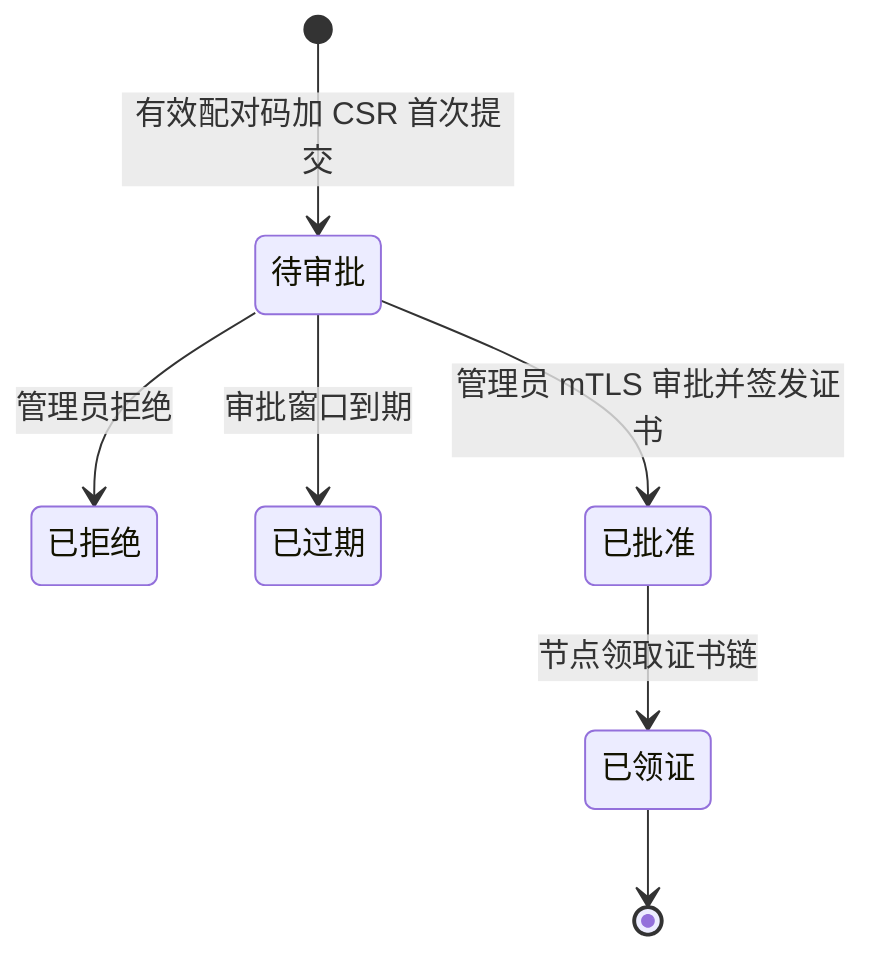

# M2 控制面详细设计

> 状态：待确认，仅完成设计，不进入编码
> 阶段：M2 控制面
> 需求基线：`docs/开发要求.md` 定稿 v1.0（2026-05-27）
> 前置实现：M1 已由提交 `3d1e9e7`、`d4444cf`、`c2275f8`、`10ffd19` 落地
> 文档作用：明确 M2 的可实施边界、协议与安全验收；若本文与需求基线冲突，以需求基线为准。

## 1. M2 必须满足的要求

### 1.1 本阶段交付边界

M2 只交付主节点与下载节点之间的安全控制基础，以及受保护的节点管理操作。

| 类别 | M2 必须交付 |
| --- | --- |
| 安全配对 | 管理员创建短时一次性配对凭据、节点提交登记请求、管理员在高风险鉴权下审批并签发节点证书 |
| 主动控制连接 | 下载节点主动连接主节点，控制连接不依赖下载节点暴露公网管理端口，适配 NAT 部署 |
| TLS 身份 | TLS 1.3、配对后控制通道 mTLS、主节点校验节点证书身份、节点固定信任主节点 CA 或证书指纹 |
| 控制协议 | 协议版本协商、消息信封、重放防护、心跳及响应、状态/报告接收、服务端关闭原因 |
| 节点状态 | 管理状态、连接状态、同步就绪状态分离；支持待配对、同步中、离线、禁用等状态管理 |
| 上报骨架 | 心跳、压力和库存上报合同及持久化接收骨架；不执行资产追平或公共路由 |
| 离线屏蔽 | 心跳超时后节点立即不可参与未来路由资格，并记录状态变更与中文审计/告警 |
| 管理 API | 仅管理网络访问、强随机管理令牌认证、对高风险节点操作叠加管理员 mTLS |
| 请求关联 | 管理请求、配对申请/审批、控制连接、心跳与节点操作任务保持请求 ID 和消息 ID 关联 |

### 1.2 必须继承且不可改变的基线规则

| 主题 | M2 固定规则 |
| --- | --- |
| 主节点拓扑 | 首版仍为单一主节点，不设计选主、复制或多主一致性 |
| 连接方向 | 仅下载节点主动连接主节点控制监听地址，不建立主节点反向拨号管理节点的机制 |
| 初次接入 | 一次性配对码必须短时有效、只可成功使用一次；普通日志不保存明文 |
| 控制消息 | 节点领证后，心跳、库存、压力与任务消息只能在认证控制通道上传输 |
| 可路由语义 | 新节点完成配对后只可进入同步准备/同步中状态；M2 不得把节点标记为“在线可路由” |
| 管理身份 | 管理 API 不使用公开 PoW；必须同时执行管理网络限制与强随机管理令牌验证 |
| 高风险操作 | 节点配对审批、证书轮换、节点禁用、同步强制重置必须额外验证管理员客户端 mTLS |
| 敏感信息 | 管理令牌、配对码明文、证书私钥、完整客户端 IP 不得写入普通日志 |
| 文本与规模 | 中文界面/错误/日志/注释/文档，UTF-8；源码、SQL 和脚本原则上单文件不超过 250 行 |

### 1.3 M2 明确不实现的功能

下列能力仅允许为消息类型、数据列或服务接口保留扩展位置，不得在 M2 声称可用：

- M3 的 GitHub Release 扫描、源站 `sha256:` 摘要校验、目标库存形成、资产下载/清理、全量追平与最终对账。
- M4 的四个公共页面、ALTCHA、公开 API PoW、公共下载授权、节点绑定令牌与 Range 文件下载。
- M5 的额度实际扣减、流量事件入账、下载授权统计、可用性/SLA 聚合与展示。
- M6 的完整协议/部署公开交付、性能验收和最终生产加固。

M2 可接收库存与压力消息并记录“节点已报告什么”，但不得将库存条目变成已校验可服务副本，也不得据此签发公共下载授权。

## 2. 与 M1 实现的衔接结论

### 2.1 已有基础直接沿用

| M1 已实现内容 | M2 使用方式 |
| --- | --- |
| `cmd/master`、`cmd/node` 两个入口 | 继续只负责装配生命周期；新增服务实现在 `internal/master/` 与 `internal/node/` |
| `server.management_listen` 默认回环限制 | M2 在该独立监听器挂载管理 API，并叠加请求来源 CIDR 判断 |
| `server.control_listen` 与 `master.control_address` | M2 启用节点主动连接的 mTLS 控制监听和客户端拨号 |
| `node.heartbeat_timeout`、`node.pairing_code_ttl` | M2 作为离线判断和配对码过期的配置来源 |
| `node.tls.*`、下载节点 `tls.*` | M2 加载并验证 CA、服务端/客户端证书与私钥路径 |
| `admin.allowed_cidrs`、`admin.token_env`、`admin.high_risk_require_mtls` | M2 正式执行管理鉴权；固定值 `true` 不允许降级 |
| 请求 ID 中间件与中文结构化日志 | 管理 HTTP 请求沿用；控制连接引入相同关联字段 |
| 主节点 SQLite 迁移执行器 | M2 只通过新增迁移扩展，不改写 M1 已应用迁移 |
| `nodes`、`pairing_codes`、`node_tasks`、`node_heartbeats`、`admin_audit_events` | M2 作为节点、配对、消息处理和审计基础表使用 |

### 2.2 M1 预留但 M2 不得误用的内容

| 已有表/字段 | M2 限制 |
| --- | --- |
| `nodes.routing_ready` | 新配对或已连接节点始终保持 `0`；只有 M3 最终对账流程未来可修改为真 |
| `target_inventory`、`node_inventory` | 可保留为空或仅由未来 M3 写入；M2 库存报告不得写入“已校验可服务”结论 |
| `assets`、`releases`、`projects` | M2 不运行扫描和摘要校验，不基于这些表派发同步任务 |
| `traffic_events`、`download_authorizations`、统计表 | M2 不启用下载、流量入账或 SLA 汇总 |

## 3. 目录与模块变化方案

M2 实现确认后拟新增以下模块。职责按协议、主节点、下载节点分离；不把业务逻辑堆入入口文件。

```text
mirror-server/
├─ cmd/
│  ├─ master/main.go                         # 只装配管理服务、控制服务和离线监测
│  └─ node/main.go                           # 只装配登记/控制客户端和基础健康服务
├─ internal/
│  ├─ protocol/
│  │  ├─ version.go                          # 协议版本及能力枚举
│  │  ├─ envelope.go                         # 控制消息信封、消息类型和校验
│  │  ├─ pairing.go                          # 登记 CSR 与证书响应合同
│  │  ├─ heartbeat.go                        # 心跳、压力、库存报告合同
│  │  └─ framing.go                          # 长度前缀 JSON 编解码与大小限制
│  ├─ controltls/
│  │  ├─ master.go                           # 主节点 TLS 1.3 与 mTLS 配置构造
│  │  ├─ node.go                             # 节点固定信任与客户端证书加载
│  │  ├─ fingerprint.go                      # 证书指纹规范化和对比
│  │  └─ ca.go                               # CSR 签发接口及证书用途检查
│  ├─ master/
│  │  ├─ admin/
│  │  │  ├─ server.go                        # 独立管理 HTTP 服务和路由装配
│  │  │  ├─ auth.go                          # 管理 CIDR、Bearer 令牌、管理员 mTLS
│  │  │  ├─ pairing.go                       # 配对码、待审批登记和审批处理器
│  │  │  └─ nodes.go                         # 查询、禁用、轮换和重置处理器
│  │  └─ control/
│  │     ├─ server.go                        # mTLS 控制监听
│  │     ├─ enrollment.go                    # 独立 TLS 1.3 领证登记入口
│  │     ├─ session.go                       # 单节点活动会话和握手
│  │     ├─ heartbeat.go                     # 心跳处理及离线判定
│  │     └─ repository.go                    # 控制面状态持久化边界
│  ├─ node/
│  │  └─ control/
│  │     ├─ client.go                        # 主动连接、重连退避和连接生命周期
│  │     ├─ enroll.go                        # 本地生成密钥/CSR 与首次登记
│  │     ├─ identity.go                      # 节点身份文件和证书安全落盘
│  │     └─ report.go                        # 心跳、库存/压力骨架上报
│  └─ storage/
│     └─ migrations/
│        ├─ master/000005_control_plane.sql  # M2 增量数据结构
│        └─ node/000002_identity.sql         # M2 节点身份及上报游标
└─ docs/
   └─ M2-控制面详细设计.md
```

实现拆分要求：

- `protocol` 不依赖 HTTP 处理器、SQLite 或日志，确保协议测试可独立运行。
- `controltls` 只负责 TLS/证书规则，不决定节点业务状态。
- `master/admin` 与 `master/control` 通过服务接口操作同一节点领域存储，不互相直接写 SQL。
- `node/control` 不启动 M3 同步执行器；库存报告提供方在 M2 只返回空清单或本地已知占位信息。
- 每个新增源码/SQL 文件按职责保持在 250 行以内；若实现时发现边界不足，先拆包而不是将入口扩张。

## 4. 控制通道协议

### 4.1 传输选择

M2 采用主节点专用 TCP TLS 监听器和“4 字节网络序长度 + UTF-8 JSON 消息体”的长连接协议，而不把控制业务混入公共或管理 HTTP 服务。首次领证登记使用独立的受限 TLS 1.3 登记监听器；它不属于节点控制通道。

| 选择 | 原因 |
| --- | --- |
| 下载节点发起 TCP TLS 长连接 | 满足 NAT 部署和单向接入要求，连接状态明确 |
| TLS 1.3 后传输消息信封 | 在标准库可控范围内实现协议版本、大小限制与心跳 |
| 长度前缀 UTF-8 JSON | M2 便于检查合同和中文错误，不引入未需要的二进制协议复杂度 |
| 管理 API 独立 HTTP 监听 | 管理网络限制与节点控制身份隔离，防止路由混淆 |

两个节点出站入口的边界如下：

| 入口 | TLS 身份 | 允许消息 | 用途限制 |
| --- | --- | --- | --- |
| 独立首次登记入口 `server.enrollment_listen` | TLS 1.3，节点必须校验主节点服务端证书；节点尚无客户端证书 | `enroll_request`、`enroll_pending`、`enroll_certificate`、中文错误 | 仅提交一次性配对码与 CSR、领取获批证书；不得发送心跳或任务 |
| 控制入口 `server.control_listen` | TLS 1.3 + mTLS，握手即要求有效节点证书 | 握手、心跳、压力、库存骨架、管理关闭通知 | 客户端证书必须匹配已批准且未禁用/吊销的节点身份 |

首次登记无法在签发客户端证书前完成 mTLS，因此它是与控制端口隔离的领证引导路径，不是节点控制连接。`server.control_listen` 不提供降级到单向 TLS 的模式；证书签发完成后的全部控制业务必须进入 mTLS 控制入口。

### 4.2 协议版本与消息信封

初版协议标识固定为 `control.v1`。每条控制消息使用以下信封字段：

```json
{
  "protocol_version": "control.v1",
  "message_id": "不可预测的消息标识",
  "message_type": "heartbeat",
  "sent_at": "2026-05-27T12:00:00Z",
  "node_id": "节点标识",
  "request_id": "关联的主节点请求标识或控制会话标识",
  "reply_to": "",
  "sequence": 3,
  "payload": {}
}
```

| 字段 | 规则 |
| --- | --- |
| `protocol_version` | 必填；不支持的版本在握手时用中文拒绝并断连 |
| `message_id` | 每条消息唯一、不可预测，用于日志和重复检测 |
| `message_type` | 仅允许版本中声明的消息类型 |
| `sent_at` | UTC RFC3339Nano；超出允许时钟偏差仅用于告警，重放以序号/消息 ID 判断 |
| `node_id` | 登记前为空；mTLS 会话中必须与证书映射节点一致 |
| `request_id` | 触发链路的关联 ID；心跳使用会话建立时主节点生成的控制请求 ID |
| `reply_to` | 响应消息关联原始 `message_id` |
| `sequence` | 每条已配对节点上行控制消息的单调递增序号；同一节点持久保存最近确认值 |
| `payload` | 按 `message_type` 校验的具体合同 |

### 4.3 M2 消息集合

| 消息类型 | 方向 | mTLS 要求 | M2 行为 |
| --- | --- | --- | --- |
| `enroll_request` | 节点到主节点 | 无客户端证书，仅服务端认证 TLS | 提交配对码、节点名称、CSR、公钥指纹与能力 |
| `enroll_pending` | 主节点到节点 | 同上 | 返回待审批登记 ID 和轮询/重连等待提示 |
| `enroll_certificate` | 主节点到节点 | 同上 | 审批完成后一次性返回证书链与节点 ID，不返回私钥 |
| `hello` | 节点到主节点 | 必须 | 声明协议版本、节点 ID、最近确认上行序号和报告能力 |
| `welcome` | 主节点到节点 | 必须 | 确认会话 ID、心跳间隔、服务端接受的上行序号 |
| `heartbeat` | 节点到主节点 | 必须 | 更新连接存活、压力摘要、同步声明和可用容量 |
| `heartbeat_ack` | 主节点到节点 | 必须 | 确认序号、返回当前受控状态；M2 不返回路由资格 |
| `inventory_report` | 节点到主节点 | 必须 | 验证并保存库存报告骨架，不发起同步或校验结论 |
| `pressure_report` | 节点到主节点 | 必须 | 验证并保存压力报告骨架，不进入下载选路 |
| `node_disabled` | 主节点到节点 | 必须 | 告知禁用并关闭控制连接 |
| `certificate_rejected` | 主节点到节点 | 必须或握手失败前可记录 | 告知证书已吊销/轮换失效，拒绝后续消息 |
| `protocol_error` | 双向 | 依所属入口 | 返回中文安全错误码，随后按严重性断连 |

M3 可在同一协议版本能力协商中增加目标库存与同步任务消息；M4/M5 可增加撤销与流量报告，但 M2 不实现这些业务处理器。

### 4.4 边界保护与重放处理

| 风险 | M2 控制措施 |
| --- | --- |
| 巨大消息耗尽内存 | 每帧先校验长度上限；心跳/压力限制为小消息，库存骨架限定条目数量和总字节 |
| 重放已接收消息 | 主节点以节点 ID + 单调 `sequence` 保存已确认上行序号；重复消息返回相同确认而不重复写业务结果 |
| 伪造节点 ID | mTLS 会话只接受证书映射得到的节点 ID；忽略或拒绝不一致的载荷值 |
| 双连接争用 | 每节点至多一个活动 mTLS 会话；新会话完成身份验证后替换旧会话并审计原因 |
| 未知消息 | 返回中文协议错误并记录类型与请求 ID，不记录敏感载荷正文 |
| 降级 TLS | 服务端和客户端 `MinVersion`、`MaxVersion` 均固定为 TLS 1.3 |

## 5. TLS、mTLS 与证书签发方案

### 5.1 信任模型

| 身份材料 | 持有方 | 用途 | 保存规则 |
| --- | --- | --- | --- |
| 控制面 CA 证书 | 主节点、下载节点 | 验证控制服务和节点证书的签发链 | 可作为非敏感部署材料保存 |
| 控制面 CA 私钥 | 主节点受保护路径 | 签发/轮换节点证书，可与服务端证书 CA 分离 | 仅文件权限保护路径读取，不写数据库和日志 |
| 主节点服务端证书/私钥 | 主节点 | 首次登记和 mTLS 控制监听的服务端认证 | 私钥不得通过 API 返回或记录 |
| 节点私钥 | 下载节点本地生成 | mTLS 客户端认证 | 从不发送到主节点，不写日志 |
| 节点证书及链 | 下载节点、主节点证书登记表 | 把证书身份绑定到节点 ID | 主节点保存证书序列号、指纹、有效期和状态，不保存节点私钥 |
| 管理员客户端证书 | 运维客户端 | 为高风险管理 API 提供额外 mTLS 身份 | 主节点维护允许的管理员 CA/指纹策略 |

### 5.2 初次配对领证

1. 管理员通过管理网络和强随机管理令牌创建短时配对码；创建接口产生审计事件。
2. 下载节点在本地生成私钥和 CSR，私钥写入受限权限文件；日志只可记录公钥指纹的截断形式。
3. 节点使用固定信任的主节点 CA 或预置服务端证书指纹，连接独立的 `server.enrollment_listen` TLS 1.3 登记入口。
4. 节点发送一次 `enroll_request`，含配对码、期望公开节点名称、CSR、公钥指纹和关联请求 ID。
5. 主节点原子验证配对码摘要、有效期和未使用状态；成功接收后立即将该码标记已使用，生成待审批登记项。
6. 管理员查询待审批记录，对比节点名称和 CSR 公钥指纹，通过管理令牌并叠加管理员 mTLS 执行审批。
7. 主节点签发仅允许客户端认证用途的节点证书，将节点记录初始状态设为 `syncing`/“同步中”，且 `routing_ready=0`。
8. 节点在受限登记连接或重新连接中领取证书链并安全写盘，随后仅以 mTLS 控制入口建立正常控制会话。

配对码在第一次有效登记提交被接收时即消耗。审批拒绝、CSR 错误或节点丢失私钥时不得重新使用原码，管理员必须审计后重新生成新码。

### 5.3 节点证书校验与生命周期

| 项目 | 规则 |
| --- | --- |
| 协议 | 仅 TLS 1.3；禁止跳过证书校验 |
| 节点证书用途 | 必须包含客户端认证用途，且由控制面信任 CA 签发 |
| 主节点映射 | 以证书指纹/序列号找到唯一节点身份；证书不在已批准活动集合中则拒绝会话 |
| 节点固定信任 | 通过 `tls.ca_file` 校验主节点证书；部署可额外保存服务端证书指纹用于人工核对 |
| 证书有效期 | 使用短于长期静态凭据的有限有效期；具体天数在实现配置/部署文档中确定，过期必须拒绝 |
| 轮换 | 高风险管理操作；签发新证书后旧证书进入吊销/失效状态，旧连接关闭并要求重连 |
| 禁用 | 禁用节点立即关闭现有连接并拒绝其所有证书建立新会话 |

M2 只提供证书签发、保存、验证、轮换和禁用闭环；不将证书身份等价为资产可路由资格。

## 6. 配对状态机

### 6.1 配对码状态

| 状态 | 进入条件 | 允许操作 | 终止条件 |
| --- | --- | --- | --- |
| `issued` / 已签发 | 管理员创建，保存码摘要和过期时间 | 单次登记提交 | 成功提交、撤销或过期 |
| `consumed` / 已使用 | 有效 `enroll_request` 在事务内绑定到待审批登记 | 不允许再次提交 | 永久终态 |
| `revoked` / 已撤销 | 管理员在未使用前撤销 | 无 | 永久终态 |
| `expired` / 已过期 | 当前时间超过截止时间 | 无 | 永久终态 |

保存和日志规则：

- API 创建响应仅在创建当次返回配对码明文，数据库只保存带随机盐/安全哈希的验证材料和可展示短前缀。
- 普通日志只记录 `pairing_code_id`、请求 ID、截止时间和结果，不记录明文或可重构值。
- 无论成功、过期、撤销或错误重试，审计中均只出现配对记录 ID。

### 6.2 登记审批状态



| 状态 | 节点可做什么 | 主节点保证 |
| --- | --- | --- |
| `pending` / 待审批 | 仅凭登记 ID 查询结果，不可心跳 | 不创建活动节点控制身份 |
| `rejected` / 已拒绝 | 获取中文拒绝结果，不可重试原配对码 | 写审计，不签证 |
| `expired` / 已过期 | 获取过期结果 | 删除/封存未领取响应材料 |
| `approved` / 已批准 | 一次性领取证书链 | 创建节点 ID、证书记录，状态为同步中且不可路由 |
| `collected` / 已领证 | 以证书发起 mTLS 控制连接 | 不再通过登记入口接受控制业务 |

## 7. 管理 API 路由与安全设计

### 7.1 监听与统一鉴权顺序

M2 管理 API 仅以 HTTPS 挂载于 `server.management_listen`，不挂载到公共健康监听器、登记监听器或控制监听器。其 TLS 服务端证书用于保护 Bearer 令牌传输，高风险请求再强制校验管理员客户端证书。

每个管理请求按照下列固定顺序处理：

1. 为请求生成新的不可预测请求 ID，并在响应写入 `X-Request-ID`。
2. 从 TCP 对端地址判断来源是否位于 `admin.allowed_cidrs`；管理接口不因转发头自动扩大信任范围。
3. 从 `admin.token_env` 指向的环境变量加载管理令牌，在请求中使用 `Authorization: Bearer <token>`，以恒定时间方式比较。
4. 对标记为高风险的路由，验证 TLS 客户端证书由管理员信任 CA 签发且符合允许用途/身份。
5. 校验 JSON 请求并执行业务事务；对状态变更写 `admin_audit_events`。
6. 返回中文结果及请求 ID；日志和错误不得回显 Bearer 值、配对码明文、证书私钥或完整客户端 IP。

令牌要求：

- 启动时若管理服务启用但环境变量为空、长度或随机强度策略不满足要求，则拒绝管理服务就绪。
- 文档与示例只写环境变量名称，不提供默认令牌。
- 令牌错误对外统一返回认证失败，不披露网络或 mTLS 细节差异。

### 7.2 路由合同

路径前缀采用 `/api/admin/v1`。M2 只提供以下节点控制管理能力：

| 方法和路径 | 功能 | 管理令牌 | 管理员 mTLS | M2 输出/副作用 |
| --- | --- | --- | --- | --- |
| `POST /pairing-codes` | 创建短时一次性配对码 | 必须 | 必须 | 当次返回明文码、记录 ID、过期时间；审计创建 |
| `DELETE /pairing-codes/{id}` | 撤销未使用配对码 | 必须 | 必须 | 标记撤销；审计撤销 |
| `GET /pairing-requests` | 查询待审批登记 | 必须 | 可不要求 | 返回节点名、截断公钥指纹、状态、时间，不返回码 |
| `GET /pairing-requests/{id}` | 查看登记详情 | 必须 | 必须 | 供审批核对 CSR 指纹与元数据，不返回私钥 |
| `POST /pairing-requests/{id}/approve` | 审批并签发节点证书 | 必须 | 必须 | 新建身份/证书；强制状态同步中、不可路由 |
| `POST /pairing-requests/{id}/reject` | 拒绝登记 | 必须 | 必须 | 结束登记；审计原因摘要 |
| `GET /nodes` | 查询节点列表和控制状态 | 必须 | 可不要求 | 状态、最后心跳、证书有效期摘要、报告时间 |
| `GET /nodes/{id}` | 查询节点控制详情 | 必须 | 可不要求 | 不返回敏感材料或绝对路径 |
| `POST /nodes/{id}/disable` | 禁用节点 | 必须 | 必须 | 状态禁用、断开会话、`routing_ready=0` |
| `POST /nodes/{id}/enable` | 解除禁用以允许重新控制连接 | 必须 | 必须 | 恢复为需心跳/同步中，不可直接路由 |
| `POST /nodes/{id}/certificates/rotate` | 签发新证书并使旧证书失效 | 必须 | 必须 | 轮换审计、关闭旧连接 |
| `POST /nodes/{id}/sync-reset` | 为未来同步强制重置状态 | 必须 | 必须 | M2 仅将状态重置为同步中且不可路由，不派发 M3 任务 |

需求基线提及的手动扫描属于首版管理 API 总体范围，但属于 M3 Release 扫描业务，M2 不提供具有实际扫描效果的路由。

### 7.3 管理响应及审计字段

管理 JSON 统一返回中文消息与稳定英文键，示例：

```json
{
  "status": "pending",
  "message": "节点登记请求已接收，等待管理员审批",
  "request_id": "请求标识",
  "data": {
    "pairing_request_id": "登记标识",
    "expires_at": "2026-05-27T12:05:00Z"
  }
}
```

审计事件至少保存：

| 字段 | 内容 |
| --- | --- |
| `operation` | `pairing_code.create`、`pairing.approve`、`node.disable` 等稳定操作名 |
| `target_type`、`target_id` | 配对记录、登记请求、节点或证书标识 |
| `result` | 成功、拒绝、失败等中文可解释状态或稳定代码 |
| `request_id` | 管理请求生成的请求 ID |
| `admin_identity` | 管理员证书指纹/主体的安全摘要，高风险操作必填 |
| `created_at` | UTC 时间 |

审计不保存管理令牌、配对明文码、私钥、完整客户端 IP 或未经约束的证书载荷正文。

## 8. 节点状态机、心跳与离线判定

### 8.1 状态维度分离

需求基线列出的展示状态不能只靠一个连接布尔值推断。M2 设计将节点状态拆为三个事实，再生成面向管理查询的状态：

| 事实维度 | 值 | 责任 |
| --- | --- | --- |
| 管理状态 | `enabled`、`disabled` | 管理 API 决定；禁用优先级最高 |
| 控制连接状态 | `never_connected`、`connected`、`offline` | mTLS 会话与心跳超时决定 |
| 同步/路由准备状态 | `pending_pairing`、`syncing`、`ready` | M2 只可产生前两类；`ready` 仅供 M3 最终对账后使用 |

M2 管理输出映射规则：

| 条件 | 输出状态 | 路由资格 |
| --- | --- | --- |
| 尚无批准证书 | `待配对` | 永远不可路由 |
| 已禁用 | `禁用` | `routing_ready=0` |
| 已领证但尚未 mTLS 心跳 | `同步中` 或 `离线`（按是否曾连接） | `routing_ready=0` |
| mTLS 已连接且心跳正常 | `同步中` | `routing_ready=0` |
| 心跳超时或连接断开 | `离线` | 强制 `routing_ready=0` |
| 压力达到拥塞阈值 | M2 仅记录压力档位/候选状态，不声明公共 `拥塞` 路由结果 | `routing_ready=0` |

`在线可路由` 与用于实际选路的 `拥塞` 状态只有在 M3/M4/M5 的可服务副本、路由和压力规则完成后才可生效。

### 8.2 心跳合同

节点建立 mTLS 会话并收到 `welcome` 后，按服务端返回的间隔发送心跳。配置 `node.heartbeat_timeout` 为主节点判定离线的硬阈值；心跳间隔必须显著小于该阈值，例如不超过阈值的三分之一。

```json
{
  "status": "syncing",
  "uptime_seconds": 120,
  "active_downloads": 0,
  "free_bytes": 53687091200,
  "pressure": {
    "target_bandwidth_bps": 104857600,
    "actual_bandwidth_bps": 0,
    "ratio": 0
  },
  "inventory_digest": "",
  "inventory_report_revision": 0,
  "capabilities": ["heartbeat.v1", "inventory.report.v1", "pressure.report.v1"]
}
```

| 字段 | M2 校验/使用 |
| --- | --- |
| `status` | 仅接受节点声明为 `syncing` 等协议允许值；不能把节点自报变成可路由 |
| `uptime_seconds` | 排障辅助，不用于信任或授权 |
| `active_downloads` | M2 应为零或仅记录兼容值；不形成 M5 统计 |
| `free_bytes` | 非负整数，用于状态/未来同步预检 |
| `pressure.*` | 校验范围并记录报告骨架；M2 不按其执行公共选路 |
| `inventory_digest`、`inventory_report_revision` | 与库存消息关联，不代表主节点认可资产有效 |

### 8.3 离线判定和屏蔽行为

| 触发 | 事务性结果 | 连接处理 | 日志/审计 |
| --- | --- | --- | --- |
| 当前时间超过最后心跳时间加阈值 | 连接状态改为 `offline`，`routing_ready=0` | 主节点关闭超时会话 | 中文告警含节点 ID、会话 ID、请求 ID，不含网络敏感值 |
| TCP/TLS 会话中断 | 标记连接结束；若尚未超阈值可等待短暂重连，仍不可路由 | 清理活动会话 | 中文信息日志 |
| 管理禁用 | 管理状态 `disabled`，`routing_ready=0` | 发送禁用通知后关闭；后续握手拒绝 | 高风险审计 |
| 节点重新连接并正常心跳 | 连接状态恢复 `connected` | 建立单活动会话 | 状态仍为同步中，不自动可路由 |

M2 虽然尚无公共路由服务，也必须持久化 `routing_ready=0` 和离线结果，保证后续路由接入时不能误选失联或新节点。

## 9. 库存与压力上报合同/骨架

### 9.1 库存上报合同

库存上报只证明“节点声称持有什么”，不证明文件来自可信 GitHub 摘要、不证明最终对账完成，也不授予路由资格。

```json
{
  "report_id": "报告标识",
  "revision": 1,
  "generated_at": "2026-05-27T12:00:00Z",
  "complete": true,
  "items": [
    {
      "asset_id": "未来 M3 分配的资产标识",
      "size_bytes": 12345,
      "digest_sha256": "sha256:十六进制摘要",
      "local_state": "reported"
    }
  ]
}
```

| 字段 | 合同与 M2 行为 |
| --- | --- |
| `report_id` | 唯一报告标识，供确认与排障 |
| `revision` | 节点单调递增的库存报告版本；重复版本幂等确认 |
| `generated_at` | 节点生成时间，仅作排障 |
| `complete` | 是否为全量清单；M2 接收但不执行对账 |
| `items[].asset_id` | M3 前允许空清单；未知资产只记录拒绝/忽略结果，不创建可服务资产 |
| `items[].digest_sha256` | 格式若提供必须为 `sha256:`；M2 只验证合同格式，不认定可信来源 |
| `items[].local_state` | M2 仅接受 `reported`/`missing` 等上报态，不允许节点上报直接产生 `serviceable` |

M2 存储策略：

- 保存报告元数据、接收结果、报告修订号和关联请求 ID。
- 为限制 M2 范围，不将报告条目写为 `node_inventory.state=verified`，也不修改 `target_inventory`。
- M3 接入后，由摘要验证和对账服务决定如何将报告转入正式库存。

### 9.2 压力上报合同

```json
{
  "report_id": "报告标识",
  "sampled_at": "2026-05-27T12:00:00Z",
  "sample_window_seconds": 10,
  "target_bandwidth_bps": 104857600,
  "actual_bandwidth_bps": 0,
  "pressure_ratio": 0,
  "active_downloads": 0,
  "free_bytes": 53687091200
}
```

| 字段 | 合同与 M2 行为 |
| --- | --- |
| `sample_window_seconds` | 正整数、限制合理上限 |
| `target_bandwidth_bps` | 应与已配置节点目标值一致；不一致记录告警并以管理配置为准 |
| `actual_bandwidth_bps` | 非负整数 |
| `pressure_ratio` | 应等于实际/目标的规范化结果；主节点可重新计算避免信任伪造比值 |
| `active_downloads` | 非负整数；M2 保存但不产生下载统计 |
| `free_bytes` | 非负整数，供未来同步调度使用 |

M2 只提供最新压力样本和最近若干排障样本的保存接口，不执行基于压力的公共选路、SLA 或流量统计。

## 10. SQLite 增量迁移方案

### 10.1 原则

- M1 已应用的 `000001` 至 `000004` 主节点迁移和节点 `000001` 迁移不修改、不重写。
- M2 实现时添加新的迁移文件，继续由现有事务迁移执行器按文件名顺序应用。
- 敏感私钥和管理令牌不进入 SQLite；配对码仅存安全验证材料。
- 与未来路由有关的 `routing_ready` 在 M2 所有新建/更新路径保持为 `0`。

### 10.2 主节点 `000005_control_plane.sql`

| 表/扩展 | 关键字段 | M2 用途 |
| --- | --- | --- |
| 扩展 `pairing_codes` | `code_hint`、`revoked_at`、`consumed_by_request_id`、`created_at` | 区分撤销/消耗并安全展示记录，不保存明文 |
| `node_enrollment_requests` | `id`、`pairing_code_id`、`public_name`、`csr_pem`、`public_key_fingerprint`、`status`、`request_id`、`expires_at`、`approved_at`、`collected_at` | 待审批登记与一次领证状态 |
| `node_certificates` | `id`、`node_id`、`serial_number`、`fingerprint`、`not_before`、`not_after`、`status`、`issued_request_id`、`revoked_at` | 证书身份、轮换与禁用校验 |
| `node_control_sessions` | `id`、`node_id`、`certificate_id`、`request_id`、`connected_at`、`last_message_sequence`、`last_heartbeat_at`、`disconnected_at`、`close_reason` | 活动 mTLS 会话和重放游标 |
| `node_inventory_reports` | `id`、`node_id`、`revision`、`complete`、`item_count`、`result`、`request_id`、`reported_at` | M2 库存合同接收记录 |
| `node_pressure_reports` | `id`、`node_id`、`pressure_ratio`、`active_downloads`、`free_bytes`、`request_id`、`reported_at` | M2 压力样本骨架 |
| 扩展 `admin_audit_events` | `admin_identity`、`details_summary` | 保存高风险管理员证书摘要及无敏感值结果概要 |

实现迁移时若 SQLite 版本兼容性导致 `ALTER TABLE` 约束不便，应仅添加可空字段或建立新扩展表，避免重建 M1 数据表带来已有数据迁移风险。

建议唯一/检索约束：

- `pairing_codes(code_hash)` 唯一，配对事务只允许未消耗、未撤销且未过期记录。
- `node_enrollment_requests(pairing_code_id)` 唯一，保证每个码只对应一次登记。
- `node_certificates(fingerprint)` 和 `node_certificates(serial_number)` 唯一。
- 活动会话通过服务事务确保每节点仅一个未结束会话，并为 `node_id, last_heartbeat_at` 建索引。
- `node_inventory_reports(node_id, revision)` 唯一；压力报告按 `node_id, reported_at` 建索引。

### 10.3 下载节点 `000002_identity.sql`

| 表 | 关键字段 | M2 用途 |
| --- | --- | --- |
| `control_identity` | 单行 ID、`node_id`、`certificate_fingerprint`、`certificate_not_after`、`enrolled_at` | 保存非私钥身份元数据，与凭据文件交叉核对 |
| `control_state` | 单行 ID、`next_sequence`、`last_ack_sequence`、`last_session_id`、`updated_at` | 控制消息序号和断线重连状态 |
| `inventory_report_cursor` | 单行 ID、`next_revision`、`last_acked_revision`、`updated_at` | 库存报告幂等游标骨架 |

节点证书链与私钥继续保存在 `node.yaml` 指向的凭据/密钥文件中，私钥文件创建权限必须严格限制；本地 SQLite 不保存 PEM 私钥正文。

## 11. 请求 ID、日志与审计设计

### 11.1 关联链路

| 场景 | 生成/传播规则 |
| --- | --- |
| 管理 API 入站 | 沿用 M1 HTTP 中间件生成新的主请求 ID并返回响应头 |
| 配对码创建 | 审计和配对记录保存管理请求 ID |
| 节点登记提交 | 主节点为登记连接/请求生成控制请求 ID；若节点携带本地请求 ID，仅作为父关联值验证后记录 |
| 管理审批 | 保存审批管理请求 ID，并关联登记请求 ID、节点 ID、证书 ID |
| mTLS 会话建立 | 主节点生成会话请求 ID，`welcome` 下发供该次连接所有心跳/报告引用 |
| 心跳/压力/库存 | 信封包含会话请求 ID、消息 ID、序号；持久化报告保留该关联 |
| 管理禁用/轮换/重置 | 生成节点控制任务关联 ID；关闭消息携带任务和管理请求关联 |

### 11.2 日志字段和脱敏

M2 日志沿用 M1 的中文消息和稳定英文字段，新增以下可安全记录字段：

| 字段 | 可记录内容 |
| --- | --- |
| `request_id` | 管理请求或控制会话关联标识 |
| `message_id`、`session_id` | 控制消息和会话标识 |
| `node_id` | 已批准节点标识 |
| `pairing_request_id` | 登记记录 ID，不是配对码 |
| `certificate_id` | 证书记录 ID或截断指纹，不记录私钥或完整 PEM |
| `operation` | 管理操作稳定名 |
| `error_code` | `PAIRING_CODE_EXPIRED`、`MTLS_REQUIRED` 等稳定码 |

不得进入普通日志的内容：

- `Authorization` 管理令牌和值。
- 一次性配对码明文或完整安全哈希。
- CA、服务端、节点或管理员证书私钥。
- 完整客户端 IP；管理来源可记录是否命中允许网段，必要审计只保存受控网段标签。
- CSR/证书 PEM 正文和库存完整明细正文。

### 11.3 必需中文事件

| 事件 | 级别建议 |
| --- | --- |
| 控制监听器以 TLS 1.3 启动 | `info` |
| 创建/撤销配对码、批准/拒绝节点、禁用/启用/轮换 | 审计 + `info` 或失败 `warn` |
| 未认证或证书不匹配的控制连接 | `warn` |
| 节点心跳超时并被标记离线 | `warn` |
| 库存/压力报告合同不合法 | `warn` |
| CA/证书/私钥文件加载失败或管理令牌缺失 | `error` 并拒绝对应服务启动 |

## 12. 配置增量设计

M1 已保留主要配置形状。M2 实现时只为安全运行补充必要字段，并同步中文示例和配置测试。

| 配置字段 | 用途 | 安全规则 |
| --- | --- | --- |
| `server.enrollment_listen` | 首次配对领证的独立监听地址 | 与控制端口隔离，只接受 TLS 1.3 受限登记消息 |
| `node.heartbeat_interval` | 主节点下发/校验心跳建议间隔 | 必须小于 `node.heartbeat_timeout`，默认可取 `10s` 对应现有 `30s` 超时 |
| `node.enrollment_timeout` | 待审批/证书领取窗口 | 短时有效，不得使已消耗配对码恢复使用 |
| `node.tls.client_ca_file` | 验证下载节点证书的 CA | 控制服务启用时必填 |
| `node.tls.signing_ca_cert_file` | 签发节点证书的 CA 证书 | 不返回私钥正文 |
| `node.tls.signing_ca_key_file` | 签发节点证书的私钥路径 | 启动验证权限，日志不打印路径内容/私钥 |
| `admin.tls.cert_file`、`admin.tls.key_file` | 管理 HTTPS 服务端证书和私钥路径 | 管理 API 启用时必填，私钥不得写日志 |
| `admin.tls.client_ca_file` | 验证高风险管理请求的管理员 CA | 高风险路由启用时必填 |
| `admin.token_min_bytes` | 管理令牌启动校验策略 | 默认至少 `32` 个随机字节；配置只可提高不得降低 |
| 下载节点 `master.enrollment_address` | 节点首次登记的 TLS 1.3 地址 | 与 `master.control_address` 分离；领证后不用于控制消息 |
| 下载节点 `pairing.code_file` | 首次登记时读取一次性码的安全文件 | 成功消费后删除/失效处理方案在实现中测试 |
| 下载节点 `tls.server_name` | 服务端证书名称校验 | 禁止空值配合跳过证书校验 |

M2 不添加扫描、公开 API、下载令牌、额度或统计业务的新生效配置。

## 13. 错误合同与故障行为

### 13.1 管理 API 错误

| HTTP 状态 | 稳定错误码 | 中文含义 |
| --- | --- | --- |
| `400` | `INVALID_REQUEST` | 请求内容不合法 |
| `401` | `ADMIN_AUTH_FAILED` | 管理身份验证失败 |
| `403` | `ADMIN_NETWORK_DENIED` / `ADMIN_MTLS_REQUIRED` | 不允许从当前管理网络访问，或该操作需要管理员证书 |
| `404` | `NODE_NOT_FOUND` | 节点或登记记录不存在 |
| `409` | `PAIRING_CODE_CONSUMED` / `NODE_STATE_CONFLICT` | 配对凭据已使用或节点状态冲突 |
| `410` | `PAIRING_CODE_EXPIRED` | 配对凭据已过期 |
| `500` | `CONTROL_INTERNAL_ERROR` | 控制面处理失败，请使用请求 ID 排障 |

在鉴权失败场景，外部响应应避免披露令牌、网络与证书验证哪一步失败的可枚举细节；详细原因只进入受控审计。

### 13.2 节点协议错误

| 错误码 | 处理 |
| --- | --- |
| `PROTOCOL_VERSION_UNSUPPORTED` | 返回支持版本并关闭连接 |
| `FRAME_TOO_LARGE` | 立即关闭连接并写中文告警 |
| `PAIRING_CODE_INVALID` / `PAIRING_CODE_EXPIRED` | 拒绝登记；不回显凭据 |
| `ENROLLMENT_PENDING` | 节点等待审批并按退避重新领取 |
| `CERTIFICATE_NOT_ACTIVE` | 拒绝 mTLS 控制会话，引导运维核查轮换/禁用 |
| `MESSAGE_REPLAYED` | 幂等确认已处理序号或断连处理异常回退 |
| `NODE_DISABLED` | 通知后关闭连接，不自动重连压测主节点 |

## 14. 测试与安全验收计划

### 14.1 单元测试

| 范围 | 测试内容 | 通过标准 |
| --- | --- | --- |
| 协议信封 | 版本、消息类型、长度限制、JSON UTF-8、未知字段策略、序号 | 非法消息以中文稳定错误拒绝，不写业务数据 |
| TLS 配置 | TLS 1.3 固定、服务端/客户端 CA 校验、证书用途、过期和错误 CA | TLS 1.2、无效证书或禁用证书无法建立控制会话 |
| 配对码 | 生成熵、哈希保存、过期、撤销、并发消费、日志脱敏 | 同一码只有一个有效登记可成功 |
| CSR 签发 | 本地私钥不出节点、CSR 指纹核对、证书映射、轮换 | 主节点无节点私钥；旧证书失效 |
| 管理鉴权 | CIDR 限制、Bearer 比较、管理员 mTLS 高风险拦截 | 任一必要条件缺失均拒绝操作 |
| 状态机 | 待配对、同步中、禁用、离线、重连；禁止提前 ready | M2 任意路径不能写出 `routing_ready=1` |
| 心跳 | 正常更新、序号重复、超时、断连与重连 | 超时立即保持不可路由并有请求 ID 告警 |
| 上报合同 | 空库存、格式不合法摘要、重复修订、压力重算 | 只保存报告骨架，不产生可服务库存/统计 |
| SQLite 迁移 | M1 库升级、重复执行、唯一约束、事务失败回滚 | 已有 M1 数据不丢失，失败不部分应用 |

### 14.2 集成测试

| 场景 | 操作 | M2 期望 |
| --- | --- | --- |
| 首次配对 | 管理员创建码，节点提交 CSR，管理员 mTLS 审批，节点领证 | 一次成功，节点以 mTLS 连接，状态仅为同步中 |
| 配对码重放 | 对同一码并发提交两个 CSR | 至多一个进入待审批，另一个被拒绝且不泄漏码 |
| 证书伪造 | 未由信任 CA 签发的节点证书连接 | TLS/身份层拒绝，不能发送心跳 |
| 证书轮换 | 高风险 API 轮换证书后用旧证书重连 | 旧证书拒绝，新证书可连接；仍不可路由 |
| 节点禁用 | 正常连接节点执行禁用 | 会话关闭、心跳不再接受、不可路由 |
| 心跳断开 | 停止节点心跳超过阈值 | 节点离线并持久记录屏蔽状态 |
| 报告接收 | 节点上报库存和压力 | 可查询最近报告；未创建 M3 任务或下载能力 |
| 重启恢复 | 主节点重启后节点重连 | 从 SQLite 恢复身份/禁用状态/序号防重放信息 |

### 14.3 安全验收

| 安全要求 | 演示验收 |
| --- | --- |
| 管理 API 仅管理网络 | 从未授权来源访问时拒绝，即使提供正确令牌也不能操作 |
| 强随机管理令牌 | 未配置或弱令牌不能启动管理服务；错误令牌返回统一拒绝 |
| 高风险管理 mTLS | 只有令牌但无管理员客户端证书无法审批、禁用、轮换或重置 |
| TLS 1.3/mTLS | 正常控制消息只在 mTLS 会话通过；TLS 降级和无节点证书连接拒绝 |
| 一次性短时码 | 过期码和已消费码均不可再次领证；日志查不到明文码 |
| 身份保存校验 | 节点本地私钥不经网络发送；主节点仅保存证书身份与状态 |
| 请求 ID 贯穿 | 从创建配对码、审批到节点会话及心跳日志可按请求/关联 ID 排障 |
| 新节点不可路由 | 完成全部 M2 流程后数据库中 `routing_ready` 仍为 `0`，管理输出不称在线可路由 |

### 14.4 工程验收

- 运行 `go test ./...` 覆盖协议、安全、状态、迁移和现有 M1 回归测试。
- 运行现有行数门禁，新增 `.go`、`.sql` 和脚本无非说明性超限。
- Windows 与 Linux amd64 构建均能携带 M2 依赖通过，中文配置与日志按 UTF-8 读取无乱码。
- 检查 Git 变更未引入网页、公开 API、下载传输、扫描同步或统计实现。

## 15. M2 实现提交拆分建议

本文经确认后，M2 实现应按可独立验收的中文提交推进，不将整个控制面混为一次提交。

| 子阶段 | 交付内容 | 重点验收 |
| --- | --- | --- |
| M2-A | 协议合同、TLS 1.3/mTLS 基础、增量迁移与配置扩展 | TLS 降级拒绝、迁移兼容、协议边界 |
| M2-B | 配对码、CSR 登记、管理员 mTLS 审批、证书保存与轮换 | 一次性码、无私钥泄露、高风险鉴权 |
| M2-C | 节点主动控制连接、心跳、状态机、离线屏蔽 | NAT 方向、超时不可路由、重连 |
| M2-D | 库存/压力上报骨架、节点查询/禁用/重置、审计与请求 ID 验收 | 合同接收不越界、审计脱敏、全链路排障 |

任何子阶段发现需要实现 M3 至 M6 行为才能通过的事项，应停在协议/接口预留并回到需求确认，不得擅自扩大 M2 产品范围。

## 16. 设计阶段完成条件

- 本文写入 `docs/` 且使用 UTF-8。
- 本文未修改 `docs/开发要求.md` 定稿的业务、安全、统计或编码规则。
- 本阶段 Git 提交仅包含 M2 详细设计文档，提交标题和说明使用中文。
- 用户确认本设计后，才开始修改源码、SQL、配置样例或构建脚本。
