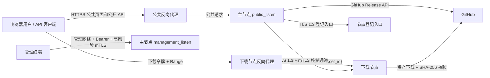

# M6 加固交付详细设计

> 状态：开工前置设计，待用户确认
> 阶段：M6 加固交付
> 需求基线：`docs/开发要求.md` 定稿 v1.1（2026-05-27）
> 前置实现：M1、M2、M3、M4、M5 已完成，M5 最新提交为 `2caf2fb`。
> 文档作用：定义 M6 的最终交付、部署、恢复、安全、性能、故障演练和验收边界。用户确认本文前，不得修改 Go 源码、SQL、配置样例或脚本。

## 1. 当前实现事实

M6 以当前仓库实现为事实基础，不重新解释 `docs/开发要求.md` 的需求基线。

| 范围 | 当前事实 |
| --- | --- |
| 主节点入口 | `cmd/master` 加载 `config.yaml`、`projects.yaml`、`quota.yaml`，启动公共监听、Release 扫描、控制面、登记入口、管理 API 和公共页面/API |
| 下载节点入口 | `cmd/node` 加载 `node.yaml`，启动登记客户端、mTLS 控制客户端、健康检查和 `/downloads/` 文件服务 |
| 公共链路 | `internal/master/public` 已提供下载、统计、关于、节点状态页面和 `/api/public/v1/*` |
| 管理链路 | `internal/master/admin` 已提供配对、节点、同步、统计、授权和流量事件查询接口 |
| 控制协议 | `internal/protocol` 已包含 `traffic_event`、`traffic_event_ack`、`traffic_replay_request` 消息类型 |
| 额度统计 | `internal/master/public` 授权事务已接入请求桶、流量预留、授权统计和 SLA 采样 |
| 节点补报 | 下载节点写入 `pending_traffic_events`，控制客户端补报未确认事件，主节点幂等入账 |
| 迁移 | 主节点已有 `000001` 至 `000009_accounting_m5.sql`；下载节点已有 `000001` 至 `000004_traffic_events_m5.sql` |
| 配置样例 | `configs/` 与 `internal/config/templates/` 已存在四类示例配置 |
| 脚本 | `scripts/build-windows.bat`、`scripts/build-linux-amd64.sh`、`scripts/check-file-lines.ps1` 已存在 |
| 文档缺口 | `docs/配置与部署.md` 在 M6 设计前不存在，M6 文档阶段需要补齐 |

## 2. M6 最终交付范围

M6 的目标是把已完成的首版功能加固为可交付版本，重点是部署可复现、故障可恢复、安全边界可验收、性能负载有明确门槛、文档合同与实现一致。

| 类别 | M6 交付 |
| --- | --- |
| 部署交付 | 主节点、下载节点、反向代理、证书、签名密钥、SQLite、日志和数据目录的最终部署说明 |
| 启动升级 | 首次启动、普通重启、滚动升级、迁移前备份、失败回滚和降级止损流程 |
| SQLite 恢复 | 主节点和下载节点状态库备份、WAL 检查、迁移失败恢复、恢复后数据一致性校验 |
| 节点恢复 | 节点断线补报、同步中断恢复、主节点重启后授权/额度/统计恢复规则 |
| 安全验收 | 代理头、下载令牌、客户端前缀、节点配对、管理入口、高风险 mTLS、日志脱敏验收 |
| 性能验收 | 并发授权、Range 下载、流量事件补报、节点 SLA 采样、额度桶并发扣减验收 |
| 故障演练 | GitHub 限频、节点离线、同步中断、事件重复/乱序、磁盘不足、证书过期/轮换 |
| 合同收口 | 公开页面、公开 API、管理 API、节点协议、数据事务和配置部署文档更新为最终交付版 |

M6 不新增账号体系、私有仓库、多主高可用、GitHub Webhook、第三方对象存储或管理前端。确需新增小型修复代码时，必须在本文确认后按 M6 子阶段独立实现、独立测试、独立中文提交。

## 3. 部署拓扑

首版交付拓扑固定为单主节点、多下载节点。



| 组件 | 暴露面 | 要求 |
| --- | --- | --- |
| 主节点公共入口 | 对公网开放 | 只挂载公共页面和 `/api/public/v1/*`，不挂载管理 API |
| 主节点管理入口 | 管理网络或回环 | Bearer 管理令牌必需，高风险操作叠加管理员 mTLS |
| 主节点登记入口 | 仅节点接入网络 | TLS 1.3 服务端认证，短时配对码，不承载正式控制消息 |
| 主节点控制入口 | 仅下载节点接入 | TLS 1.3 + 节点 mTLS，不对浏览器或管理客户端开放 |
| 下载节点公共入口 | 对公网开放或经反代开放 | 只服务 `/downloads/{asset_id}` 和健康检查，不暴露控制端口 |
| SQLite 与日志 | 本机文件系统 | 独立数据目录，纳入备份和权限隔离 |

## 4. 启动、升级与回滚流程

### 4.1 主节点首次启动

1. 使用 UTF-8 编辑并部署 `config.yaml`、`projects.yaml`、`quota.yaml`。
2. 生成强随机管理令牌并写入 `admin.token_env` 指向的环境变量，不写入 YAML 明文。
3. 部署管理 API HTTPS 证书、管理员客户端 CA、节点控制证书、节点签发 CA 和下载令牌签名密钥。
4. 确认 `server.management_listen` 不暴露公网；若反向代理转发公共流量，配置 `proxy.trusted_cidrs` 只包含可信代理。
5. 启动主节点，确认 SQLite 迁移完成、公共健康检查正常、管理 API 在安全监听启动。
6. 创建一次性配对码，按节点登记流程接入下载节点。

### 4.2 下载节点首次启动

1. 使用 UTF-8 编辑并部署 `node.yaml`，确认 `master.control_address`、`master.enrollment_address` 为 HTTPS。
2. 部署主节点 CA 或服务端信任材料、下载令牌签名密钥、节点存储目录和本地状态库目录。
3. 将一次性配对码写入安全文件，启动节点登记。
4. 管理员在管理 API 审批 CSR 与公钥指纹，节点领取证书后改用 mTLS 控制连接。
5. 等待全量库存对账、缺失资产同步、最终对账完成；完成前不得参与公共下载路由。

### 4.3 升级流程

1. 停止写入型运维操作，记录当前 Git 提交、二进制版本、配置摘要和迁移版本。
2. 备份主节点 SQLite、下载节点状态库、配置文件、证书、下载令牌签名密钥和必要日志。
3. 先升级主节点，确认迁移成功、公共 API、管理 API 和控制面均恢复。
4. 分批升级下载节点；每个节点升级后必须重新建立控制连接并完成未确认流量事件补报。
5. 升级期间，未完成补报或库存对账的节点不得恢复 `routing_ready=true`。

### 4.4 回滚流程

| 场景 | 回滚规则 |
| --- | --- |
| 二进制启动失败且未发生迁移 | 恢复上一版本二进制和配置，保持数据库不变 |
| 迁移执行失败 | 停止服务，保留失败现场，使用迁移前 SQLite 备份恢复，不手工改写迁移表 |
| 主节点升级后公共授权异常 | 暂停公共入口或回滚主节点；已签发且有效的令牌仍按签名和授权状态校验 |
| 下载节点升级失败 | 将节点移出路由或保持离线，恢复旧二进制和本地状态库备份，再重连补报 |
| 签名密钥误替换 | 立即恢复原 `download_token.signing_key_file`；无法恢复时必须撤销旧授权并重新签发 |

## 5. SQLite 备份和恢复

M6 必须把 SQLite 备份作为发布前硬门槛。

| 对象 | 备份内容 |
| --- | --- |
| 主节点 | `database.path` 指向的主库、WAL/SHM 相关文件、配置、证书、签名密钥 |
| 下载节点 | `storage.state_db`、`storage.directory` 已校验资产、待确认流量事件、证书和配置 |

备份和恢复规则：

1. 备份前优先停止对应进程，或使用 SQLite 在线备份能力生成一致快照。
2. 启用 WAL 时，备份必须包含主库、`-wal`、`-shm` 或先完成 checkpoint。
3. 迁移前备份命名包含程序、版本、时间、迁移前最高版本和 Git 提交。
4. 迁移失败后不得修改生产库抢修；应复制现场用于排查，再从备份恢复。
5. 恢复后必须核对 `schema_migrations`、节点状态、授权状态、流量事件确认游标和日统计汇总。

## 6. 主节点重启恢复规则

主节点重启后必须从持久化状态恢复授权、额度、统计和节点状态。

| 数据 | 恢复规则 |
| --- | --- |
| 下载授权 | 未过期且未撤销的授权继续可查询；过期授权不再签发新令牌，不删除历史统计依据 |
| 请求额度桶 | 从 `quota_buckets` 读取余额和更新时间，按配置恢复速率补充，不重置为满桶 |
| 流量预留 | 从 `traffic_reservations` 读取预留和已结算字节；未使用或过期预留按清理策略释放 |
| 流量事件 | `(node_id, event_sequence)` 继续作为幂等主键，重复补报不得重复入账 |
| 下载授权次数 | 以已提交的授权事务和 `daily_project_stats.authorization_count` 为准，不因重启重算增加 |
| 开始传输授权数 | 以 `download_authorizations.first_transfer_at` 去重，不因事件补报重复增加 |
| SLA 样本 | 重启期间没有样本时不得计为可用；公开页面可显示样本不足 |
| 节点状态 | 节点重新完成心跳、库存/任务状态确认前，不得仅凭旧状态恢复新路由 |

## 7. 节点断线补报与同步恢复

下载节点必须先本地持久化流量事件，再通过控制通道发送。

| 场景 | M6 验收规则 |
| --- | --- |
| 控制连接断开 | 下载节点继续保存未确认事件；重连后按序补报 |
| 重复发送事件 | 主节点内容一致时幂等确认，不重复统计 |
| 事件乱序 | 主节点允许补报窗口内乱序入账，但确认游标不得越过缺口 |
| 事件内容冲突 | 主节点拒绝覆盖既有事件，记录中文安全告警 |
| 节点离线期间同步任务中断 | 节点重连后重新对账，缺失或校验失败资产重新派发任务 |
| 节点本地状态库丢失 | 必须重新登记或重新同步，不得用未登记文件直接服务公共下载 |

## 8. 安全验收

M6 必须把下列安全用例纳入阶段验收。

| 验收项 | 通过标准 |
| --- | --- |
| 伪造代理头 | 直连来源不属于 `proxy.trusted_cidrs` 时，`X-Forwarded-For` 等代理头不影响客户端前缀 |
| 伪造下载令牌 | 修改签名、声明、过期时间、授权 ID、资产 ID 或节点 ID 后，下载节点拒绝 |
| 跨节点复用 | 绑定节点 A 的令牌访问节点 B 必须失败 |
| 跨资产复用 | 绑定资产 A 的令牌访问资产 B 必须失败 |
| 跨客户端前缀复用 | 挑战、授权和下载令牌绑定的 IPv4/IPv6 前缀变化时必须失败 |
| 未配对节点 | 未经审批和 mTLS 身份的节点不能领取任务、上报有效库存或流量事件 |
| 管理 API 公网访问 | 管理 API 不挂公共监听；非管理 CIDR 和缺少 Bearer 的请求均失败 |
| 高风险操作 mTLS | 配对码、审批、证书轮换、节点禁用、同步强制重置必须校验管理员客户端证书 |
| 日志脱敏 | 普通日志不出现管理令牌、下载令牌、配对码明文、证书私钥、完整客户端 IP、完整本地路径 |

## 9. 性能与负载验收

M6 不以极限压测为目标，但必须证明首版核心并发路径不会破坏事务和统计口径。

| 用例 | 验收关注点 |
| --- | --- |
| 并发授权 | 同一 IP 地址级和网段级额度并发扣减不能透支，挑战消费和授权写入保持原子 |
| Range 下载 | 同一令牌多段 Range 不增加下载授权次数，真实发送字节按事件入账 |
| 流量事件补报 | 大量未确认事件重连补报时，主节点幂等确认且统计不重复 |
| 节点 SLA 采样 | 采样任务不会阻塞公共授权；样本不足展示明确中文提示 |
| 额度桶并发扣减 | `quota_buckets` 微单位余额恢复、扣减和回滚在并发事务下保持一致 |

建议在 M6 实现阶段补充轻量基准或集成测试，记录测试环境、并发数、资产大小、节点数和结果摘要。任何性能阈值必须写入最终交付记录，不能只存在于临时命令输出。

## 10. 故障演练

| 故障 | 演练目标 |
| --- | --- |
| GitHub 限频 | 扫描进入退避或延迟状态，不丢失既有可服务资产，不泄露 GitHub Token |
| 节点离线 | 主节点停止给该节点新授权；节点恢复后先补报和对账，再恢复路由 |
| 同步中断 | 未完成资产不得进入可服务库存；恢复后从任务状态重新同步或重新对账 |
| 流量事件重复 | 重复事件内容一致时不重复入账 |
| 流量事件乱序 | 主节点保留缺口并要求补报，不静默推进确认游标 |
| 磁盘不足 | 下载节点同步失败不落半文件；已有已验证文件不被误删；错误中文可排查 |
| 证书过期 | 过期节点证书不能建立控制连接；轮换后旧证书失效且写入审计 |
| 证书轮换 | 节点使用新证书重连，旧会话关闭，路由恢复前完成状态确认 |

## 11. 公共页面和公开 API 最终字段

### 11.1 公共页面可展示

| 页面 | 对外字段 |
| --- | --- |
| 下载 | 项目名称、仓库摘要、版本、预发布标记、架构、文件名、大小、可下载状态、中文错误、授权到期时间 |
| 统计数据 | 下载授权次数、开始传输授权数、当日真实流量、累计真实流量、项目聚合统计、统计时区、最近更新时间 |
| 节点状态 | 公开节点名、公开状态、同步就绪、最近更新时间、负载分档、24h/7d/30d SLA、样本不足提示 |
| 关于 | 服务说明、非官方镜像声明、验证与额度说明、隐私说明、联系方式 |

### 11.2 公开 API 可返回

| 接口 | 对外字段 |
| --- | --- |
| 项目列表 | `project_id`、`repository`、`display_name`、`available` |
| 项目资产 | `asset_id`、`version`、`prerelease`、`file_name`、`architecture`、`size_bytes`、`digest_sha256`、`available`、`unavailable_reason` |
| 挑战创建 | `challenge_id`、算法、难度或 ALTCHA 载荷、`expires_at`、`canonical_format` |
| 授权领取 | `authorization_id`、`download_url`、`download_token`、`expires_at`、`range_concurrency_limit`、`max_bytes` |
| 授权查询 | `authorization_id`、`asset_id`、脱敏节点标识、`state`、`expires_at`、`bytes_accounting_enabled`、`sent_bytes`、`first_transfer_at` |
| 统计 | 授权数、开始传输数、真实字节、SLA、样本不足标记 |

### 11.3 不得公开的内部字段

- 管理令牌、下载令牌签名密钥、配对码明文、证书私钥、完整 CSR/证书正文。
- 完整客户端 IP、完整客户端网段明细、额度桶精确余额、封禁/豁免明细。
- 节点内部地址、控制端口、管理监听地址、磁盘路径、临时文件路径。
- GitHub Token、源站敏感请求头、同步任务内部错误全文。
- 单个流量事件完整明细、完整请求 URL 查询令牌、可绕过 PoW 或 ALTCHA 的规范材料。

## 12. 中文、请求 ID、脱敏和编码

- 所有业务错误、运维错误、日志摘要和文档继续使用中文。
- 每个 HTTP 响应继续返回 `X-Request-ID`；JSON 错误和成功响应继续包含 `request_id`。
- 控制面消息、同步任务、授权、下载节点请求和流量事件必须保留请求 ID 或任务 ID 关联。
- 普通日志只记录脱敏前缀、截断授权 ID、节点 ID、资产 ID、请求 ID、稳定错误码和中文摘要。
- 源码、配置、前端资源、脚本、日志和 Markdown 继续使用 UTF-8。
- Windows PowerShell 读取中文文档、YAML 或日志时必须显式使用 `-Encoding UTF8`。
- 新增或修改的 Go、SQL、脚本和前端资源继续受 250 行限制；`docs/*.md` 不受限制。

## 13. M6 建议实现子阶段

用户确认本文后，M6 建议拆分为下列子阶段。每个子阶段必须独立中文 Git 提交，并完成对应阶段验收测试。

| 子阶段 | 交付内容 | 阶段验收 |
| --- | --- | --- |
| M6-A 部署文档与启动核验 | 补齐部署拓扑、启动、升级、回滚、备份恢复文档；必要时补启动前检查 | 文档审查，UTF-8 读取，配置字段与实现一致 |
| M6-B 恢复与补报加固 | 验证迁移失败恢复、主节点重启恢复、节点断线补报和同步中断恢复 | 恢复测试、重复/乱序补报测试、授权和统计不重复 |
| M6-C 安全验收加固 | 补齐代理头、令牌复用、未配对节点、管理公网、高风险 mTLS、日志脱敏测试 | 安全用例全部可复现，敏感值全文搜索无泄露 |
| M6-D 性能负载验收 | 并发授权、Range 下载、补报吞吐、SLA 采样、额度桶并发扣减测试 | 记录测试环境、命令、结果和残余风险 |
| M6-E 故障演练与交付收口 | GitHub 限频、节点离线、磁盘不足、证书过期/轮换演练和最终合同回归 | 最终验收命令通过，合同文档与实现一致 |

## 14. 最终交付验收命令

M6 最终交付至少运行：

```powershell
go test ./...
.\scripts\check-file-lines.ps1
git diff --check
```

Windows PowerShell 读取中文文件必须显式指定 UTF-8，例如：

```powershell
Get-Content -Encoding UTF8 docs/开发要求.md
Get-Content -Encoding UTF8 docs/M6-加固交付详细设计.md
```

若 `go test ./...` 因 Windows Go 缓存目录权限失败，应切换到仓库可写缓存后重跑，不得把缓存权限问题误判为业务测试失败。

## 15. 开工确认门禁

本文与同步更新的 `docs/配置与部署.md`、`docs/数据模型与事务.md`、`docs/节点通信协议.md`、`docs/管理API.md`、`docs/公开API.md` 只作为 M6 开工前置设计。用户确认前必须停止在文档阶段，不得开始任何 M6 Go 源码、SQL、配置样例或脚本实现。
