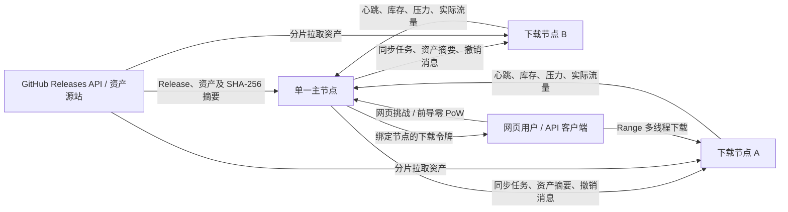

# 镜像服务器开发要求

> 状态：需求定稿 v1.1  
> 日期：2026-05-27  
> 范围：本文件定义首版产品、架构、安全协议、数据口径、阶段文档门禁和验收要求。

## 1. 已确认的产品决策

| 事项          | 已确认规则                                                               |
| ----------- | ------------------------------------------------------------------- |
| GitHub 仓库范围 | 仅支持公开仓库，不支持私有仓库；支持正式 Release 与预发布 Release                           |
| 文件完整性       | 下载节点保存资产前必须使用 GitHub API 返回的 `digest` 中 `sha256:` 摘要校验；缺失或算法不符即拒绝镜像 |
| 副本策略        | 每个下载节点均应持有主节点配置的所有项目在保留窗口内的全部可服务资产                                  |
| 新节点加入       | 新节点先执行全量库存对账与缺失资产同步，满足就绪条件后才能承载公共下载                                 |
| 用户验证        | 用户前端使用自研 SHA-256 前导零挑战，不增加滑块；默认使用中等工作量配置                              |
| API 身份      | 公开 API 不采用账号体系或 API Key，使用 SHA-256 前导零 PoW、IP 配额和下载令牌               |
| IP 配额       | 增加 IPv6：单地址按 `/128`，网段按 `/64`                                       |
| 下载倍率        | 仅影响下载请求额度扣减，不放大每日流量扣减，也不改变实际流量统计                                    |
| 下载次数        | 用户通过验证后，主节点每签发一个下载令牌，计为一次下载授权次数                                     |
| 传输辅助统计      | 内部必须记录“开始传输授权数”，与公开的“下载授权次数”分离                                      |
| 管理形态        | 首版不提供管理后台页面；管理 API 仅向管理网络开放并使用强随机管理令牌，节点高风险操作增加 mTLS                |
| 主节点数量       | 首版及当前目标均为单主节点，不设计多主一致性                                              |
| 公共页面        | 下载、统计、关于、节点状态，共四个页面                                                 |
| 日志关联        | 每个请求生成请求 ID，并贯穿授权、节点下载与流量上报链路                                       |
| 文档约束        | 所有 Markdown 文档放入 `docs/`；Markdown 文件不受 250 行限制                      |
| 文本编码        | 源码、配置、前端资源、日志与文档统一使用 UTF-8；Windows 脚本和运维读取显式指定 UTF-8                |
| 当前实施状态      | M1 基础骨架已经实现；M2 控制面已完成详细设计但尚未开始代码实现，后续按阶段文档门禁推进                      |

## 2. 产品目标与工程约束

- 使用 Golang 开发 GitHub Release 分布式镜像服务，由单一主节点集中决策，下载节点保存资产并承载下载流量。
- 项目界面、接口错误信息、配置注释、日志、运维文档均使用中文；协议字段和代码标识符可使用英文。
- 所有包含中文或需要跨平台处理的文本文件统一使用 UTF-8 编码；不得依赖操作系统默认代码页读写配置、文档或日志。
- 源码、前端资源及非 Markdown 维护文件原则上单文件不超过 250 行；超过时必须按职责拆分并说明原因。
- `docs/` 下的 Markdown 文档允许超过 250 行，以保证协议、安全和运维描述完整。
- 模块必须高内聚、低耦合：业务规则不得散落在 HTTP 处理器、页面脚本或数据库访问代码中。
- 主节点集中处理路由、防刷、额度、统计和节点管理；下载节点不得自行绕过主节点签发公共下载授权。

## 3. 首版范围

| 范围         | 首版要求                                                  |
| ---------- | ----------------------------------------------------- |
| Release 同步 | 定期读取 `projects.yaml`，检查公开 GitHub 仓库正式版与预发布版 Release   |
| 全量镜像       | 每一个可下载节点同步每一个启用项目在保留窗口内的所有目标资产                        |
| 分布式控制      | 支持节点加密配对、心跳、压力上报、库存核对、离线屏蔽和新增节点追平                     |
| 公共网站       | 下载页面、统计数据页面、关于页面、节点状态页面                               |
| 下载保护       | 网页前导零挑战、中心额度检查、绑定单一节点的下载令牌                         |
| 公开 API     | 无账号访问，SHA-256 前导零 PoW 后获取下载授权，主节点签发令牌、下载节点传输文件        |
| 管理 API     | 提供受保护的运维接口；首版不制作管理前端                                  |
| 统计         | 文件下载授权次数、每日及累计实际流量、节点可用性和 SLA 展示                      |
| 运维         | 中文 YAML 注释、分级日志、按日日志文件、请求 ID、Windows/Linux-amd64 构建脚本 |
| 文档         | 数据模型与事务、公开 API、管理 API、主从节点通信协议以及部署/配置文档全部放在 `docs/`   |

首版不要求私有仓库、多主高可用、GitHub Webhook 接收、第三方对象存储或可视化管理后台。

## 4. 角色与信任边界

| 角色      | 职责                                    | 不可信输入                   |
| ------- | ------------------------------------- | ----------------------- |
| 主节点     | 页面/API、验证、额度、路由、同步调度、统计、节点控制面         | 用户请求、代理头、节点报告、GitHub 响应 |
| 下载节点    | 拉取和保存 Release 文件、校验摘要、Range 下载、真实流量回报 | 用户下载请求、外部文件、控制面消息       |
| 浏览器用户   | 使用网页挑战完成验证后领取令牌并下载                | 浏览器计算结果、IP/请求头          |
| API 客户端 | 完成 SHA-256 前导零 PoW 后领取下载令牌            | 调用参数、PoW 结果             |
| 运维人员    | 编辑 YAML、调用管理 API、读取日志                 | 管理凭据和操作请求               |
| GitHub  | Release 元数据与资产源站                      | 重定向、文件内容、限频响应、摘要字段      |

## 5. 总体架构

### 5.1 主节点模块

| 模块     | 责任                                   |
| ------ | ------------------------------------ |
| 公共网站   | 服务四个公共页面及中文静态资源                      |
| 验证服务   | 创建和校验网页挑战及 API 前导零 PoW 挑战，防止重放 |
| 下载授权   | 原子扣减请求额度、预留流量预算、选择节点、签发及撤销令牌         |
| 项目扫描   | 读取项目规则，检查正式版和预发布版 Release，形成目标库存     |
| 全量同步调度 | 将目标库存差异派发至全部节点，处理加入、重连和补齐            |
| 节点控制   | 安全配对、任务派发、心跳、状态机和协议版本管理              |
| 路由调度   | 在已校验持有文件的在线节点间按照压力与健康度选路             |
| 额度中心   | IPv4/IPv6 请求令牌桶与日流量预算                |
| 统计中心   | 授权次数、实际传输字节、每日聚合、节点 SLA              |
| 基础设施   | YAML 配置、数据库、中文日志、请求 ID、健康检查          |

### 5.2 下载节点模块

| 模块      | 责任                               |
| ------- | -------------------------------- |
| 安全控制客户端 | 主动连接主节点、证书身份、心跳、任务和撤销消息          |
| 库存同步器   | 获取目标库存、发现缺失或错误文件、全量/增量追平         |
| 下载执行器   | 多线程或分片拉取资产、SHA-256 校验、原子落盘、旧版本清理 |
| 文件服务    | 校验令牌，支持 HTTP Range 与并发分片，输出文件    |
| 计量回报    | 按授权、IP 和请求 ID 回报真实发送字节、完成状态和当前带宽 |

## 6. 配置文件合同

所有 YAML 初次生成时带详细中文注释；缺字段时使用默认值并写中文告警，非法关键字段则拒绝启动。

| 文件              | 所属程序 | 必须覆盖的配置                                                                                   |
| --------------- | ---- | ----------------------------------------------------------------------------------------- |
| `config.yaml`   | 主节点  | 监听端口、扫描间隔、受信代理 CIDR、网页挑战参数、API 前导零 PoW 参数、日志等级与目录、数据库、令牌有效期、节点离线阈值、统计时区、管理 API 保护方式 |
| `projects.yaml` | 主节点  | 公开 GitHub 仓库、启用状态、保留版本数、下载倍率、文件名架构提取正则、是否同步预发布版、资产过滤规则                                    |
| `quota.yaml`    | 主节点  | IPv4 `/32`/`/24` 与 IPv6 `/128`/`/64` 请求令牌桶、日流量上限、黑名单/豁免规则                                 |
| `node.yaml`     | 下载节点 | 主节点地址、节点名称、监听端口、存储目录、目标带宽、最大同步线程、同步带宽限制、日志配置、配对凭据路径                                       |

### 6.1 已确定默认值

| 配置项                             | 默认值                        |
| ------------------------------- | -------------------------- |
| 每项目保留版本数量                       | `3`                        |
| 网页挑战工作量                       | `中等`，由 `altcha.difficulty` 兼容配置项覆盖 |
| API PoW 算法                      | `SHA-256` 前导零挑战            |
| API PoW 默认难度                    | 摘要前导 `23` 个二进制零位           |
| IPv4 `/32` 下载请求桶                | `120` 令牌，`48h` 完全恢复        |
| IPv4 `/24` 下载请求桶                | `600` 令牌，`48h` 完全恢复        |
| IPv6 `/128` 下载请求桶               | `120` 令牌，`48h` 完全恢复        |
| IPv6 `/64` 下载请求桶                | `600` 令牌，`48h` 完全恢复        |
| IPv4 `/32`、IPv6 `/128` 每日实际传输上限 | `3 GiB`                    |
| IPv4 `/24`、IPv6 `/64` 每日实际传输上限  | `20 GiB`                   |
| 日统计与日限额时区                       | `Asia/Shanghai`，允许配置覆盖     |

### 6.2 验证参数约束

- 网页验证使用自研 SHA-256 前导零挑战，浏览器优先使用 WASM/Worker 求解，缺少 WASM 时回退到 Web Crypto；默认配置档位为 `中等`，并通过桌面端与移动端体验测试确定默认值。
- API 验证独立实现 SHA-256 前导零挑战，默认要求摘要满足前导 `23` 个二进制零位；该数值可在 YAML 中调整。
- 两种挑战都必须绑定短时随机挑战、下载文件意图和客户端 IP 前缀，并拒绝重放、过期及被篡改的提交。
- 网页挑战难度参数与 API 前导零位数不得混用或相互解释；具体参数与基准环境写入部署文档。

## 7. GitHub Release 同步与摘要校验

1. 主节点加载并验证 `projects.yaml`；只允许公开仓库地址。
2. 因项目可启用预发布版，不应仅依赖“最新稳定版”接口；扫描器需要列出 Releases，再按配置选择正式版及预发布版。
3. 请求保存 `ETag`/`Last-Modified` 并使用条件请求，遵守 GitHub 限频及重试响应。
4. 主节点为每个选中的资产记录版本、预发布标记、文件名、大小、下载地址和 GitHub `digest`。
5. 可同步资产必须具有格式为 `sha256:<十六进制摘要>` 的可信摘要；算法不支持或摘要缺失时，严格拒绝镜像该资产并写中文告警。
6. 主节点生成“目标库存”：每个启用项目保留窗口内匹配过滤条件的所有资产，要求每个下载节点最终一致持有。
7. 主节点向每个在线节点派发其缺失或摘要不一致的资产任务，任务携带 GitHub SHA-256 值。
8. 下载节点并行下载到临时路径，完成后计算 SHA-256 与任务摘要比对；校验通过后原子落盘并回报。
9. 任何校验失败、下载中断或摘要不一致的文件均不得进入可服务库存。
10. 旧版本超过保留数量时，主节点更新目标库存并派发清理任务；清理不得删除仍被有效下载令牌引用的文件。

### 7.1 新节点加入与重新上线同步

1. 新节点完成加密配对后进入 `同步中` 状态，首先上报本地空库存或已有库存清单。
2. 主节点下发当前完整目标库存及缺失任务，新节点按照同步并发数和同步带宽上限补齐文件。
3. 同步期间需要持续跟进新发布的 Release，避免基线同步结束时再次落后。
4. 新节点仅在目标库存全部校验通过并完成一次最终对账后进入 `在线可路由` 状态；初次同步期间即使部分文件已完成，也不得承载公共下载。
5. 离线后恢复的已有节点同样执行差异对账；过期文件清理和缺失文件下载均完成后恢复路由。
6. 节点可回报同步进度，状态页面可以展示“同步中”，但不得展示敏感存储路径或管理细节。

## 8. 节点配对、加密与状态

- 下载节点到主节点建立主动控制连接，适配节点处于 NAT 或无公网管理端口的部署环境。
- 首版使用 TLS 1.3 与双向证书认证；主节点保存节点证书身份，节点固定信任主节点 CA 或证书指纹。
- 首次配对使用一次性配对码，必须短时有效且只能使用一次；确认节点名称和指纹后签发节点证书。
- 配对完成后，任务、心跳、库存、流量报告和撤销消息仅可在认证控制通道上传输。
- 下载令牌由主节点签名，绑定节点 ID、文件 ID、客户端 IP 前缀、有效期、最大可传字节和并发 Range 限制。
- 节点定期上报 `实际带宽 / 目标带宽` 压力比、活动下载数、磁盘空间、库存摘要和同步状态。
- 节点状态至少包含 `待配对`、`同步中`、`在线可路由`、`拥塞`、`离线`、`禁用`。
- 超过心跳阈值的节点立即移出新路由；重新上线并完成库存对账后才恢复新授权。

## 9. 网页挑战与用户验证流程

### 9.1 采用建议

- 网页端采用自研 SHA-256 前导零挑战，不再叠加滑块。
- 浏览器端优先使用 C 编译的 WASM 求解器，并通过多个 Web Worker 分片搜索 nonce；缺少 WASM 支持时使用 Web Crypto 回退。
- 网页端默认工作量档位为 `中等`，最终实现参数在移动端和桌面端基准验收后写入配置示例。
- 对公开镜像下载场景，网页链路采用“网页挑战 + 中心额度 + 短时节点令牌”。
- 前导零挑战主要增加自动化成本，不能证明请求来自真人；具备算力和 IP 池的恶意方仍必须由额度、流量预算和封禁规则约束。

### 9.2 网页下载流程

1. 下载页展示项目、版本、架构、文件大小与可用状态；用户选择文件后请求网页挑战。
2. 主节点签发短时挑战，挑战绑定文件意图、客户端网段、有效期与一次性随机量。
3. 浏览器完成前导零挑战，主节点校验解决方案、有效期和重放状态。
4. 验证通过后，主节点解析真实 IP，同时检查对应 IPv4 或 IPv6 的单地址与网段限制。
5. 主节点在数据库事务中扣减按项目倍率计算的请求额度，并预留该次授权可能产生的实际流量预算。
6. 主节点选择持有已校验文件且健康的单一下载节点，签发并下发绑定节点的下载令牌。
7. 用户可使用同一令牌发起受限数量的 HTTP Range 请求，实现多线程下载和断点续传。
8. 下载节点持续上报实际传输字节；主节点按实际字节结算每日流量预算并写入统计。
9. 配额耗尽、节点异常或授权滥用时，主节点撤销令牌并向节点广播临时阻断信息。

## 10. 公开 API 与管理 API

### 10.1 公开 API 原则

- API 面向公开客户端，不要求注册账号或提供 API Key。
- API 使用独立的 SHA-256 前导零 PoW，默认难度为前导 `23` 个二进制零位，并接受同样的 IP/网段额度和日流量限制。
- API 不得直接获得任意节点文件地址，必须通过主节点领取短时绑定节点下载令牌。

| 接口类别 | 功能                       | 关键输出                      |
| ---- | ------------------------ | ------------------------- |
| 项目查询 | 列出项目、版本、架构及可下载资产         | 文件 ID、大小、版本、架构、可用状态       |
| 挑战申请 | 针对资产创建 SHA-256 前导零挑战     | 挑战 ID、随机量、前导零位数、截止时间、算法版本 |
| 挑战提交 | 提交 nonce 并校验前导零结果，申请下载授权 | 授权 ID 或中文拒绝原因             |
| 下载路由 | 完成额度检查并获得节点 URL          | 单节点短时下载令牌、到期时间            |
| 授权查询 | 查询本次授权用量和状态              | 已发送字节、有效期、结束状态            |

### 10.2 管理 API 原则

- 首版没有管理页面，但必须提供受保护管理 API 以支持节点配对审批、手动扫描、节点禁用与状态查询。
- 管理 API 不属于公开 API，不使用公开 PoW 作为身份认证替代品。
- 管理 API 仅允许管理网络访问，并要求强随机管理令牌认证；令牌不得写入日志或公开配置示例。
- 节点配对审批、证书轮换、节点禁用、同步强制重置等高风险节点操作除管理令牌外还必须在 mTLS 认证通道中执行。

### 10.3 必须编写的接口文档

| 文档                | 必须覆盖内容                                                    |
| ----------------- | --------------------------------------------------------- |
| `docs/公开API.md`   | 请求/响应 JSON、SHA-256 前导零 PoW 计算规则、令牌领取、错误码、Range 示例、重试和额度拒绝 |
| `docs/管理API.md`   | 鉴权方式、节点审批/禁用、同步控制、统计查询、审计字段和危险操作约束                        |
| `docs/节点通信协议.md`  | 配对、mTLS、心跳、同步任务、库存、撤销、流量事件、重放与版本兼容                        |
| `docs/数据模型与事务.md` | 主节点和下载节点数据表、状态枚举、索引、迁移、原子事务、幂等与故障恢复                       |
| `docs/配置与部署.md`   | YAML 全字段、证书部署、反向代理、UTF-8 编码规则、日志、构建产物和备份恢复                |

## 11. 防刷、额度与流量规则

- 客户端 IP 只在直连来源属于 `config.yaml` 的受信代理 CIDR 时从转发头解析；否则使用 TCP 对端地址。
- IPv4 请求同时作用于 `/32` 与 `/24`；IPv6 请求同时作用于 `/128` 与 `/64`，任一额度不足均拒绝签发令牌。
- 项目下载倍率只作用于请求令牌桶扣减，例如倍率 `3` 表示一次授权消耗 `3` 个请求令牌。
- 下载倍率不作用于每日流量限制，也不作用于当日/累计实际流量统计；流量全部按节点真实发送字节计入。
- 日流量限制同时作用于单地址和对应网段；重传、重复 Range 和中途中断前已发送的字节均计入。
- 为阻止同一 IP 并发向不同节点透支，主节点必须在签发令牌前原子预留流量预算；广播撤销或阻断仅用于快速止损。
- 节点流量事件携带单调序号、授权 ID 与请求 ID，主节点幂等入账；节点断线重连后补报未确认事件。

## 12. 下载次数与统计口径

| 指标      | 定义                         |
| ------- | -------------------------- |
| 下载授权次数  | 用户完成验证后，主节点成功签发一个下载令牌即计数一次 |
| 开始传输授权数 | 内部必须记录：某令牌首次产生实际响应体字节时计数一次 |
| 当日流量    | 统计日内所有下载节点实际写给客户端的字节总和     |
| 历史每日流量  | 按配置时区聚合的每日实际传输字节汇总         |
| 累计流量    | 自首次运行以来所有已入账实际传输字节之和       |
| 节点压力    | 平滑后的实际出口带宽除以配置目标带宽         |
| 节点可用性   | 在统计窗口内节点处于在线可路由且心跳正常的时长比例  |

### 12.1 下载令牌计数的行为说明

- 同一令牌下的多线程 Range 请求和断点续传不会增加下载授权次数，因此能合并一次授权内的分片下载。
- 用户领取令牌后未开始传输，仍会被计为一次下载授权；该指标不是“完整文件成功下载次数”。
- 令牌过期后用户重新完成验证并获得新令牌，会再计一次，即使其目的只是继续一次中断下载。
- 页面明确显示“下载授权次数”，系统内部保留“开始传输授权数”，用于判断领取后未下载的比例和排障。

## 13. 路由、离线处理与状态页面

| 情况          | 主节点行为                        |
| ----------- | ---------------------------- |
| 多个在线节点均持有文件 | 排除拥塞节点后，优先选择压力比低且近期错误少的节点    |
| 新节点同步中      | 展示同步中状态，不对其签发公共下载令牌          |
| 节点心跳超时      | 立即停止新路由，标记离线并记录中文告警          |
| 节点高错误率      | 降低路由资格或隔离，等待重新健康确认           |
| 文件校验失败      | 不发布该文件副本，重试或重新同步             |
| 下载中节点下线     | 用户可重新完成授权路由；已发实际流量不退还、不重复扣除  |
| 主节点重启       | 从持久化授权、额度和节点状态恢复；节点重新确认前不可路由 |

### 13.1 公共节点状态页面

- 展示每个公开节点名称、当前状态、最近可用性、SLA 统计窗口、是否同步就绪和最近更新时间。
- SLA 至少提供近 `24h`、`7d` 和 `30d` 三个窗口的可用率；新节点应明确展示统计样本不足。
- 可展示经平滑和分档后的负载状态，例如“空闲/正常/繁忙”，不公开实时带宽目标、内部地址或控制面信息。
- 页面不展示下载令牌、证书、磁盘路径、完整客户端 IP 或足以绕过防刷的细节。

## 14. 前端与中文体验

| 页面   | 内容                                           |
| ---- | -------------------------------------------- |
| 下载页面 | 项目卡片、项目图标、版本选择、架构选择、启用后系统选择、文件大小、网页挑战验证、下载状态和中文错误提示 |
| 统计数据 | 下载授权次数、累计流量、当日流量、历史每日流量趋势、按项目聚合授权数           |
| 节点状态 | 节点在线/同步/离线状态、SLA、可用性、更新时间和负载分档               |
| 关于页面 | 服务说明、镜像非官方声明、额度与验证说明、隐私说明、联系方式               |

- 前端不使用浏览器原生 `alert`/`confirm` 展现业务流程，使用统一中文对话框和提示组件。
- 下载页支持浅色/深色模式，默认跟随系统主题并允许用户手动切换后持久化选择。
- 项目图标由主节点根据 `projects.yaml` 的本地图标配置读取并提供；图标缺失时回退内置占位图标，不影响下载授权链路。
- 网页挑战需要显示计算状态、可取消操作、设备高负载提示和失败重试，移动端体验需单独验收。
- 页面只展示至少有一个已校验、在线可路由副本的资产；无可用节点时明确显示“暂不可下载”。

## 15. 日志、请求 ID 与存储

- 日志级别固定为 `debug`、`info`、`warn`、`error`；控制台与文件等级分别由 YAML 配置。
- 文件日志按自然日切分，保留周期与目录可配置；敏感值、完整令牌、证书私钥和完整 IP 不得写入普通日志。
- 日志文件、YAML 和所有 Markdown 输出均为 UTF-8；Windows PowerShell 运维示例读取中文文件时使用 `Get-Content -Encoding UTF8`。
- 主节点收到的每个 HTTP 请求都生成不可预测的请求 ID；可接受格式正确的上游 ID 作为父关联值，但主键由本程序生成。
- 主节点在 HTTP 响应返回 `X-Request-ID`，并将其关联到验证挑战、下载授权、节点任务和统计事件。
- 下载节点收到带令牌的请求后记录自身请求 ID及主节点授权关联 ID；流量上报携带二者，便于跨节点排查失败。
- 控制面消息、中文错误响应和审计日志必须包含相关请求 ID 或任务 ID。
- 主节点首版使用 SQLite 持久化项目、节点、授权、额度、摘要和统计，以事务保障原子预留。
- 下载节点使用文件系统保存资产，并持久化尚未被主节点确认的流量事件；资产落盘采用临时文件加原子替换。

## 16. 推荐项目结构

| 目录                                              | 职责                            |
| ----------------------------------------------- | ----------------------------- |
| `cmd/master`、`cmd/node`                         | 两个可执行程序入口，仅组装依赖               |
| `internal/config`、`internal/logging`            | 中文 YAML 配置与日志、请求 ID 基础设施      |
| `internal/master/public`                        | 公共页面及公开 API                   |
| `internal/master/admin`                         | 受保护管理 API                     |
| `internal/master/auth`                          | 网页挑战、API 前导零 PoW、令牌签发与撤销 |
| `internal/master/quota`、`internal/master/stats` | 额度、流量和 SLA 统计                 |
| `internal/master/sync`、`internal/master/nodes`  | GitHub 扫描、目标库存、节点控制和路由        |
| `internal/node/sync`、`internal/node/files`      | 资产同步、SHA-256 校验和下载服务          |
| `internal/node/report`                          | 心跳、压力、库存和流量回报                 |
| `internal/protocol`                             | 控制面消息、令牌声明、签名和协议版本合同          |
| `web/`                                          | 四个公共页面、中文资源、网页挑战接入层、嵌入式 html/js/css 资源 |
| `configs/`、`scripts/`                           | 示例配置和构建脚本                     |
| `docs/`                                         | 全部 Markdown 需求、API、协议、部署及运维文档 |

## 17. 阶段文档门禁与当前衔接

### 17.1 文档先于对应代码

| 文档                | 首次必须完成时点        | 完成标准                                            | 后续必须更新阶段    |
| ----------------- | --------------- | ----------------------------------------------- | ----------- |
| `docs/数据模型与事务.md` | 原应在 M1 数据库实现前完成 | 描述现有表与迁移事实，标明 M2 至 M5 可新增的数据边界、关键事务和不得破坏的兼容约束   | M2、M3、M5、M6 |
| `docs/节点通信协议.md`  | M2 控制面代码实现前     | 定义配对、证书、mTLS、连接、消息字段、状态机、幂等、重放、错误、超时和离线处理       | M3、M5、M6    |
| `docs/管理API.md`   | M2 管理 API 代码实现前 | 定义管理网络限制、管理令牌、管理员 mTLS 高风险操作、请求/响应、错误码、审计和请求 ID | M3、M5、M6    |
| `docs/公开API.md`   | M4 公开下载链路代码实现前  | 定义查询、API 前导零 PoW、授权、令牌、Range、额度拒绝、错误码和请求 ID     | M5、M6       |

### 17.2 阶段结束更新义务

- 每个阶段实现完成后，Agent 必须更新该阶段影响到的合同文档，使文档与最终代码行为一致，并记录有意偏离原设计的原因。
- 新增接口、协议字段、数据库表/索引/迁移、状态枚举、安全校验或统计口径，必须在同一阶段同步反映到对应文档。
- 阶段验收应同时检查代码、测试和合同文档，任何仅在代码中存在而未写入合同的关键行为均视为未完成。

## 18. 构建、测试与验收

- 构建脚本必须提供 `scripts/build-windows.bat` 与 `scripts/build-linux-amd64.sh`，输出主节点和下载节点两个二进制及带中文注释的示例配置。
- 配置测试覆盖默认值、非法值、IPv4/IPv6 网段和受信代理解析。
- 跨平台验收覆盖 Windows 与 Linux 读取中文 YAML、文档和日志均无乱码，构建/运维脚本不依赖本地默认代码页。
- 同步测试覆盖预发布版选择、GitHub `digest` 缺失/算法不符/摘要不匹配时严格拒绝、全节点目标库存、新节点全量追平及旧版本清理。
- 验证与额度测试覆盖网页挑战中等档配置、API 前导 `23` 零位挑战、两类挑战重放拒绝、倍率仅扣请求桶、流量原始字节计量和并发预留。
- 下载测试覆盖节点绑定令牌、过期/撤销、Range 多线程、断点续传、授权次数口径和实际流量幂等。
- 节点测试覆盖 mTLS 配对、初次全量同步期间不可路由、心跳离线屏蔽、重连对账、压力路由、请求 ID 链路和 SLA 聚合。
- 联调必须演示新 Release 自动同步到全部节点、新节点加入后追平、节点下线后不再被选中、同 IP 并发不能越过额度、网页和 API 下载完成。
- 安全验收必须演示伪造代理头无效、伪造或跨节点复用令牌无效、未配对节点无法领取任务、管理 API 无法从公共网络访问、高风险节点操作强制 mTLS、日志不泄露凭据。
- 源码和前端资源行数检查纳入持续集成；`docs/*.md` 明确排除出 250 行失败规则。

## 19. 分阶段开发顺序

| 阶段      | 状态与交付                                                                                        |
| ------- | -------------------------------------------------------------------------------------------- |
| M1 基础骨架 | **已实现**：两程序、配置/日志/请求 ID、SQLite 迁移、中文健康页、构建脚本；需在 M2 前补写 `数据模型与事务.md`                          |
| M2 控制面  | **设计已开始，代码前置门禁生效**：先完成 `数据模型与事务.md`、`节点通信协议.md`、`管理API.md`，再实现安全配对、心跳、节点状态、库存、压力、离线屏蔽和管理 API |
| M3 镜像同步 | 实现前更新节点协议和数据事务文档：正式/预发布扫描、GitHub 摘要、全节点同步、新节点追平、SHA-256 校验                                   |
| M4 下载链路 | 实现前完成 `公开API.md`：四个页面、网页挑战验证、API 前导零 PoW、签名令牌、Range 下载、公开 API                           |
| M5 额度统计 | 更新四份合同文档：IPv4/IPv6 中心预留、流量回报、授权次数、统计页、状态/SLA 页                                               |
| M6 加固交付 | 将四份合同与部署文档整理为最终交付版，完成故障恢复、安全测试、性能及负载验证                                                       |

## 20. 定稿约束

- 本文所列产品行为、安全边界、额度口径、统计口径、文档与编码规则均作为首版实现合同。
- GitHub 摘要缺失或不是 `sha256:` 时严格拒绝镜像；不得以节点自行计算摘要代替源站可信摘要。
- 管理 API 采用管理网络限制和强随机管理令牌；高风险节点操作必须叠加 mTLS。
- 新节点初次全量同步与最终对账完成前不得参与公共下载路由。
- 对外统计“下载授权次数”，内部同时持久化“开始传输授权数”用于质量分析与排障。
- M1 既有实现以补写数据合同和必要的最小迁移方式纳入后续开发；M2 代码实现必须在三份前置合同文档确认后开始。

## 21. 外部接口依据

- GitHub Release Assets REST API（资产响应中的 `digest` 示例）：<https://docs.github.com/en/rest/releases/assets>
- GitHub Releases REST API：<https://docs.github.com/en/rest/releases/releases>
- GitHub REST API 最佳实践（条件请求、退避等）：<https://docs.github.com/en/rest/using-the-rest-api/best-practices-for-using-the-rest-api>
- GitHub REST API 限频规则：<https://docs.github.com/en/rest/using-the-rest-api/rate-limits-for-the-rest-api>
